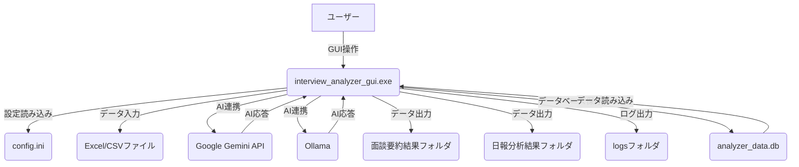

# 基本設計書

## 1. はじめに
本ドキュメントは、面談分析ツールの基本設計について記述します。本ツールは、面談データや日報データをAIを用いて分析し、要約やアドバイス、危険信号の判定などを行うCLIアプリケーションです。

## 2. システム構成

### 2.1. 全体アーキテクチャ
本システムは、Pythonで開発されたCLIアプリケーションであり、ユーザーからの入力に応じて各種データ処理、AI連携、ファイル出力を行います。

### 2.2. 主要コンポーネント

*   **`app_gui.py`**: アプリケーションのGUIを実装。ユーザーインターフェース、処理フロー制御、各機能モジュールの呼び出しを行います。
*   **`config.ini`**: AIバックエンド（Gemini/Ollama）の選択、APIキー、OllamaのURL/モデル名、日報集計期間などの設定を保持します。
*   **データファイル (Excel/CSV)**: 面談データや日報データの入力元となるファイルです。
*   **Google Gemini API**: クラウドベースのAIサービス。要約、アドバイス生成、危険信号判定に利用されます。
*   **Ollama**: ローカルでLLMを実行するためのツール。インターネット接続なしでAI機能を提供します。
*   **出力フォルダ (`面談要約結果`, `日報分析結果`)**: 分析結果のCSVファイルを保存するディレクトリです。
*   **Database (SQLite)**: 面談要約結果および日報分析結果を保存するローカルデータベース (`analyzer_data.db`)。AI質問応答機能の知識ベースとして利用されます。

## 3. 機能設計

### 3.1. 機能一覧

本ツールは以下の機能を提供します。

1.  **新しい面談ファイルの分析と要約作成**: 指定された面談データファイル（Excel/CSV）を読み込み、AIを用いて要約とアドバイスを生成し、個別のCSVファイルとして出力します。
2.  **既存の要約データを使ったAI対話**: 既存の面談要約データおよび日報分析データをもとに、AIとの質疑応答セッションを提供します。
3.  **日報データの分析**: 指定された日報Excelファイルを読み込み、設定された期間（週ごと/月ごと）で集計・分析し、要約、アドバイス、危険信号の判定結果をCSVファイルとして出力します。

### 3.2. 処理フロー

#### 3.2.1. アプリケーション起動からメインメニュー
1.  `interview_analyzer_gui.exe` 実行。
2.  `config.ini` を読み込み、AIバックエンド設定を初期化。
3.  GUIが表示され、ユーザーはモード選択ラジオボタンで操作を選択する。
4.  各処理完了後、GUIは操作可能な状態に戻る。

#### 3.2.2. モード1: 新しい面談ファイルの分析と要約作成
1.  ユーザーがGUI上で「面談分析」を選択し、ファイルまたはフォルダのパスをテキストボックスに入力（またはドラッグ＆ドロップ）し、「分析実行」ボタンをクリックする。
2.  入力されたファイル（またはフォルダ内の全ファイル）を読み込む。
3.  AIを用いてデータ構造（縦持ち/横持ち）を判別する。
4.  AIの判別結果に基づき、プログラムが入力ファイルの全項目とその内容をテキスト形式で抽出する。
5.  抽出されたテキスト全体に対し、AIによる要約とアドバイスを生成する。
6.  従業員ごとに要約結果をCSVファイルとして「面談要約結果」フォルダに出力する。

#### 3.2.3. モード2: 既存の要約データを使ったAI対話
1.  ユーザーがGUI上で「AI対話」を選択し、「AI対話開始」ボタンをクリックする。
2.  **ローカルのSQLiteデータベースから既存の面談要約データおよび日報分析データをすべて読み込む。**
3.  読み込んだデータを結合し、AI質問応答のためのコンテキストを生成する。
4.  ユーザーが質問入力フィールドに質問を入力し、「送信」ボタンをクリックする。
5.  AIが質問に回答し、ログエリアに表示する。
6.  ユーザーが「対話終了」ボタンを押すまで質疑応答を繰り返す。

#### 3.2.4. モード3: 日報データの分析
1.  ユーザーがGUI上で「日報分析」を選択し、日報Excelファイルのパスをテキストボックスに入力（またはドラッグ＆ドロップ）し、「分析実行」ボタンをクリックする。
2.  指定された日報Excelファイルを読み込む。
3.  各シート（従業員名と仮定）の日報データを期間（週ごと/月ごと）でグループ化する。
4.  各期間の日報内容を結合し、AIによる要約、アドバイス、危険信号の判定を生成する。
    *   **危険信号の判断基準**: 業務上の問題、体調不良のいずれか、または複数に該当するかを判断します。
5.  分析結果をCSVファイルとして「日報分析結果」フォルダに出力する。

## 4. データ設計

### 4.1. 入力データ

*   **面談データ**: Excel (`.xlsx`) または CSV (`.csv`) 形式。
    *   AIがデータサンプルから「横持ち」または「縦持ち」形式を判断する。
    *   横持ち形式: 従業員ID、面談コメント、得意分野などの列を持つ。
    *   縦持ち形式: 「項目」「記入内容」の2列で構成され、各行が異なる項目を表す。
*   **日報データ**: Excel (`.xlsx`) 形式。
    *   各シートが従業員の日報を表す。
    *   想定される列: `タイムスタンプ` (形式: `YYYY/MM/DD HH:MM:SS`)、`今日の体調`、`今日の気分`、`今日の業務内容`、`業務での課題や悩み`、`その他、共有事項`。

### 4.2. 出力データ

*   **面談要約結果**: `面談要約結果` フォルダ内に、従業員ごとのCSVファイルとして出力されます。**また、AI質問応答機能の知識ベースとして、ローカルのSQLiteデータベースにも保存されます。**
    *   例: `山田太郎_20250714.csv` (面談日取得時) または `山田太郎_20250714-103249.csv` (面談日不明時)
    *   内容: 元のデータに加え、「面談結果要約」「AIによるアドバイス」列が追加されます。
*   **日報分析結果**: `日報分析結果` フォルダ内に、従業員ごと、期間ごとのCSVファイルとして出力されます。**また、AI質問応答機能の知識ベースとして、ローカルのSQLiteデータベースにも保存されます。**
    *   例: `鈴木花子_20240101-20240107_日報分析.csv`
    *   内容: 「日報内容要約」「AIによるアドバイス」「危険信号」「危険信号の根拠」列が追加されます。

## 5. 非機能要件

*   **動作環境**: Windows OS (PyInstallerでビルドされたexeファイルとして提供)。
*   **AI連携**: Google Gemini API または Ollama (ローカル実行) を選択可能。
*   **ロギング**: 処理状況やエラーはログファイル (`logs/`) に出力されます。
*   **エラーハンドリング**: ファイル読み込みエラー、AI応答エラーなど、主要なエラーについてはログ出力およびユーザーへの通知を行います。
*   **データ安全性**: 元の入力データファイルが上書きされたり、変更されたりすることはありません。

## 6. 今後の課題・拡張性

*   AIモデルの選択肢の拡充。
*   より詳細な分析レポートの生成機能。
*   Web UIの提供など、ユーザーインターフェースの改善。
